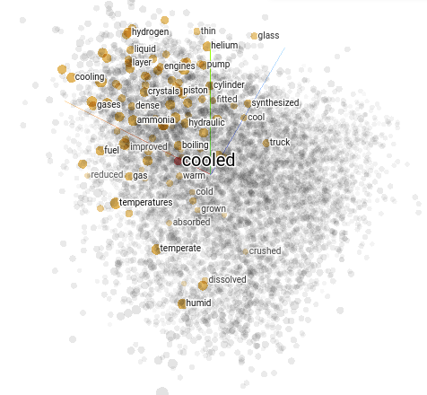

# Representing Knowledge

Learn about knowledge representation

### The traditionnal way to represent knowledge

Representing knowledge is key to any AI application, traditionally knowledge was encoded into graphs using ontologies or property graph systems. 

Due to the difficulty to model a knowledge domain and the burden in creating the graph data only some specific domains with strict taxonomy still use graph based knowledge systems, like biology, or domains with highly connected data, like social medias and finantial applications.

### Representing knowledge with vectors

Recently with the rise of deep Learning, unstructured knowledge (texts, posts, books etc.) became available to AI systems. However neural networks have a completely different way to represent data, with the use of vectors.

<figure>

<figcaption align = "center"><b>Fig.1 - Vector of words represented in 3 dimension illustrating this concept, similar words are close together</b></figcaption>

</figure>

This new way of representing and working with unstructured knowledge created new kind of applications like vector databases and similarity augmented generation.

### Combining Vector and Graph representations

Combining these two kind of representation is key to our vision of the future and neuro-symbolic approach. This hybrid representation allow for similarity based data retrevial strategies combined with precise and efficient strategies provided by the graph.

Our framework support at that time two types of storage for knowledge:
- The filesystem that store the documents along with their folders, allowing the system to navigate inside its long-term memory using a shell.
- The program memory that store the graph prompt programs and provide the dependency graph of HybridAGI's programs

These two structures contains on their leaves the content that is beeing indexed by the embedding vectors, allowing the system to also perform similarity based search.

<figure>

<figcaption align = "center"><b>Fig.2 - HybridAGI long-term memory implementing a file system like structure of folders and files</b></figcaption>

</figure>

<figure>

<figcaption align = "center"><b>Fig.3 - HybridAGI program memory implementing the dependency graph of its prompt programs</b></figcaption>

</figure>