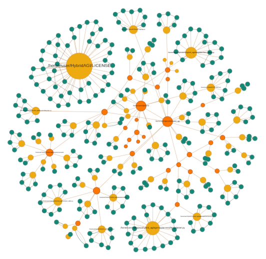
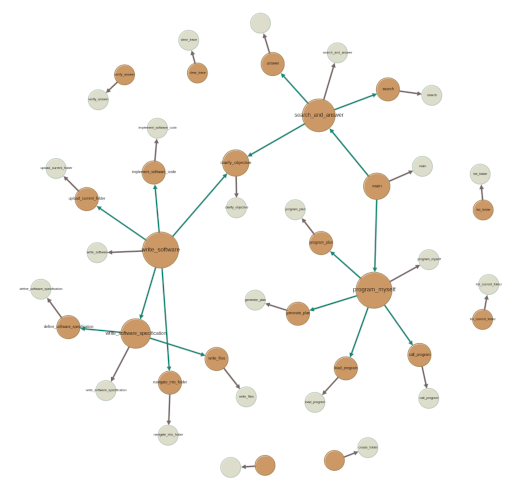

# Representing Knowledge

Explore the realm of knowledge representation.

## The Traditional Way to Represent Knowledge

Knowledge representation is pivotal in any AI application. Traditionally, knowledge was encoded into graphs using ontologies or property graph systems.

Due to the challenges in modeling a knowledge domain and the labor-intensive process of creating graph data, only specific domains with strict taxonomies still employ graph-based knowledge systems. Examples include biology or domains with highly interconnected data, such as social media and financial applications.

## Representing Knowledge with Vectors

With the advent of deep learning, unstructured knowledge (texts, posts, books, etc.) has become accessible to AI systems. However, neural networks represent data in a completely different way, using vectors.

<figure>
  

    
    <figcaption align="center"><b>Fig.1 - Vectors of words represented in 3 dimensions, illustrating this concept; similar words are close together.</b></figcaption>
  

</figure>

This novel approach to represent and work with unstructured knowledge has given rise to new applications such as vector databases and similarity-augmented generation.

## Combining Vector and Graph Representations

The fusion of these two types of representation is fundamental to our vision of the future and the neuro-symbolic approach. This hybrid representation allows for similarity-based data retrieval strategies combined with precise and efficient strategies provided by graphs.

Our framework currently supports 3 types of knowledge store:

- **Filesystem:** Stores documents along with their folders, enabling the system to navigate its long-term memory using a shell.
  
- **Program Memory:** Stores the graph prompt programs and provides the dependency graph of HybridAGI's programs.

- **Trace Memory:** Stores the program traces and index each past action.

Each structure contains content indexed by the embedding vectors at their leaves, enabling the system to perform similarity-based searches.

<figure>
  

    
    <figcaption align="center"><b>Fig.2 - HybridAGI's long-term memory implements a file system-like structure of folders and files. This architecture enables the AI system to navigate and explore its vector store in a Unix-like fashion.</b></figcaption>
  

</figure>

<figure>
  

    
    <figcaption align="center"><b>Fig.3 - HybridAGI's program memory implements the dependency graph of its prompt programs. This structure protects the main prompt program from being modified by the AI system.</b></figcaption>
  

</figure>

<figure>
  

    
    <figcaption align="center"><b>Fig.4 - HybridAGI's trace memory indexes each past action, allowing the AI system to recall past actions between sessions.</b></figcaption>
  

</figure>