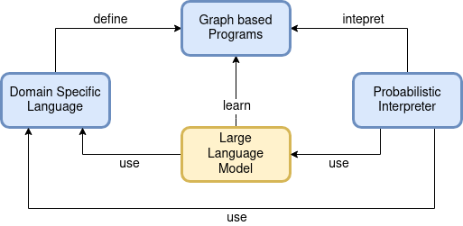

# Neuro-Symbolic AI Systems
Explore the world of neuro-symbolic AI systems

## What is a Neuro-Symbolic AI System?

Neuro-symbolic systems represent a sophisticated approach to artificial intelligence (AI) by merging symbolic AI and connectionist (neural network) AI.

Neuro-symbolic AI systems consist of two main components:

- **Gradient-Based Learnable Functions (Neural Networks):** These components involve neural networks capable of learning through gradients.
  
- **Symbolic Implementation or Specification:** This includes functions with a symbolic implementation or, at the very least, a symbolic specification of their functionality.

By integrating symbolic reasoning with neural network learning, these systems excel in both deductive reasoning (logical inference) and inductive learning (pattern recognition).

## An Explainable and Controlled Approach

Our approach draws inspiration from computer science and symbolic AI, addressing the limitations of Large Language Models (LLMs). The primary goal is to develop safe, controlled, and explainable AI systems that can operate locally.

Our system features a Domain-Specific Language (DSL) for programming LLM-based Agents, defining the syntax of graph programs. Programs are articulated as graphs of actions, involving tool usage and explicit decision-making steps for branching within the graph. The interpreter uses the DSL and LLM to make probabilistic decisions and apply tools as per the given program.

<figure>
  

    
    <figcaption align="center"><b>Fig.1 - The main components of our approach, with symbolic components highlighted in blue.</b></figcaption>
  

</figure>

In essence, our system adheres to a graph to execute instructions accurately. If we conceptualize a program as a network, interpreting it involves finding the correct path within the graph. Consequently, HybridAGI can *solely* execute tasks described as programs, providing a secure and controlled framework for AGI.

Thanks to our approach, developers can rectify, enhance, and impart implicit knowledge to the LLM, a task that would have been challenging without this framework.
